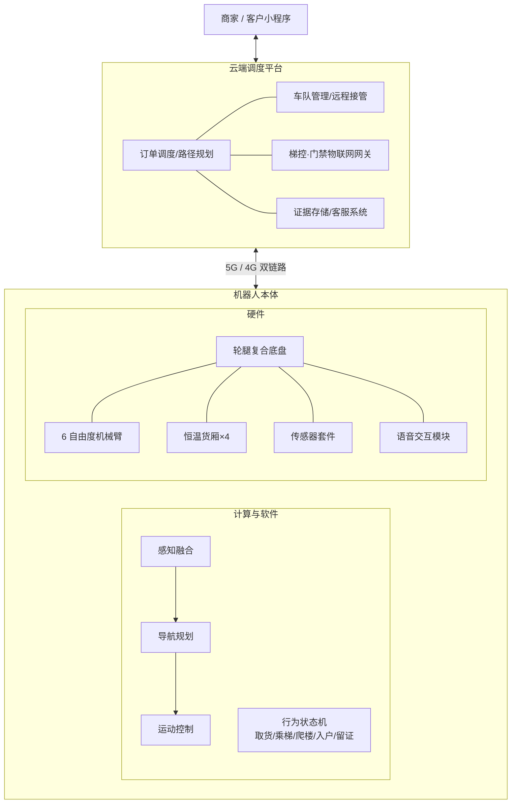
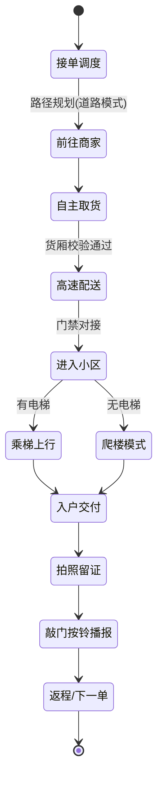
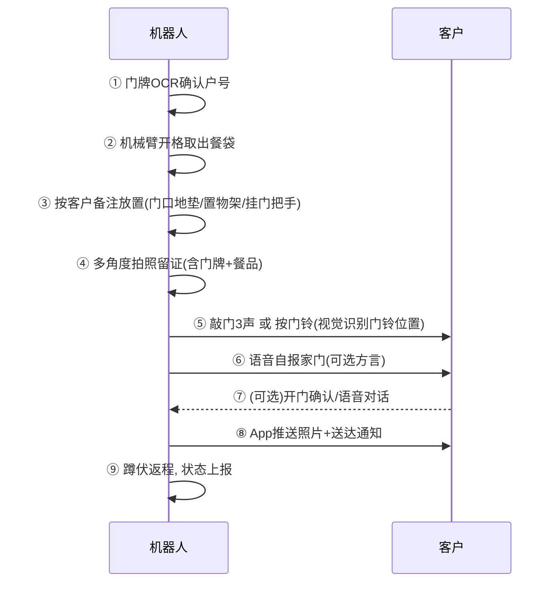

# “骑手小哥” 城市外卖配送机器人设计方案

> 面向中国城市环境的全链路自主外卖配送机器人：最高时速 50 km/h，
> 自主取货、自主乘梯、爬楼入户、自主取放货、拍照留证、敲门/按铃并自报家门。

---

## 1. 设计目标与场景分析

### 1.1 核心能力清单

| # | 能力 | 说明 |
|---|------|------|
| 1 | 高速行进 | 道路模式最高 50 km/h，完成跨商圈长距离配送 |
| 2 | 自主取货 | 在商家/前置仓自主对接取餐柜或接收人工放餐 |
| 3 | 自主进出电梯 | 优先物联网梯控直连，机械臂按键作为兜底 |
| 4 | 爬楼梯 | 轮腿复合构型，应对无电梯老旧小区（6 层及以下步梯楼） |
| 5 | 自主取放货 | 机械臂从保温货厢取出餐品，放置到客户指定位置（门口置物架、挂钩等） |
| 6 | 拍照留证 | 放置完成后拍照上传，作为送达凭证 |
| 7 | 敲门/按门铃 | 机械臂敲门或按门铃 |
| 8 | 自报家门 | 语音播报：平台、订单、取餐方式，支持方言/普通话 |

### 1.2 中国城市环境的特殊约束

- **道路环境**：非机动车道电动车密集、混行严重；路口外卖高峰流量大；井盖、减速带、积水多。
- **社区环境**：封闭式小区有门禁、闸机、保安岗；高层住宅依赖电梯；大量 2000 年前老旧小区无电梯、楼道窄（净宽常见 1.0–1.2 m）、声控灯、楼道堆物。
- **电梯环境**：品牌型号杂、改造率低，高峰期满载率高，需要“能联网走联网、不能联网会按键、挤不进会等待/让行”。
- **气候**：南方梅雨、回南天，北方冬季 -20 ℃ 低温与冰雪路面，整机需 IP66 防护与宽温域电池热管理。
- **法规**：各地智能网联/无人配送车管理细则（北京、深圳、杭州等已发牌照试点）、《个人信息保护法》（拍照留证涉及人脸与门牌信息）、低速无人车上路速度上限要求。

> **关于 50 km/h 的合规说明**：50 km/h 为整机设计能力上限，仅在政策允许的机动车道/专用道路段启用；
> 在非机动车道自动限速 ≤15–25 km/h（按当地细则），小区与楼内 ≤5 km/h，电梯/楼道内 ≤1 m/s。
> 限速策略由云端电子围栏 + 车端地图属性双重锁定，不可被现场篡改。

---

## 2. 总体架构

### 2.1 形态：轮腿复合（Wheel-Leg Hybrid）

同时满足“50 km/h 高速”与“爬楼入户”两个相互矛盾的需求，采用 **四轮腿构型**（每条腿末端为带轮毂电机的驱动轮）：

- **轮行模式**：四腿收拢锁定为低重心四轮底盘，轮毂电机直驱，高速巡航。
- **腿行模式**：楼梯前切换为四足步态，轮子锁止当作“足端”，逐级攀爬；适应踏步高 ≤180 mm、进深 ≥240 mm 的标准住宅楼梯，可上下 30° 斜坡。
- **蹲伏模式**：整机下蹲降高至 0.9 m，通过小区闸机、低矮门洞，并在电梯内缩小占地。

### 2.2 关键规格

| 项目 | 指标 |
|------|------|
| 整机尺寸（轮行） | 长 1.05 m × 宽 0.58 m × 高 1.15 m（蹲伏 0.9 m，腿行站高 1.3 m） |
| 整备质量 | ≤ 65 kg（满载 ≤ 85 kg），楼内对地压强满足住宅楼板要求 |
| 最高速度 | 道路 50 km/h；非机动车道 ≤25 km/h；楼内 ≤1 m/s |
| 载货 | 4 个独立恒温格口（2 热 1 冷 1 常温），单格 540×400×320 mm，总载重 20 kg |
| 续航 | 城市混合工况 80 km / 约 35 单；换电 90 s（标准化换电柜） |
| 电池 | 48 V 磷酸铁锂 1.5 kWh ×2（双电冗余），-30~55 ℃ 自加热热管理 |
| 防护 | 整机 IP66，货厢 IPX7；涉水深度 15 cm |
| 通信 | 5G+4G 双卡双待、V2X（路口信号灯）、BLE/UWB（梯控、门禁、取餐柜） |
| 定位 | GNSS RTK（室外 2 cm）+ 激光 SLAM + 视觉重定位（室内楼宇） |
| 爬楼能力 | 踏步高 ≤18 cm，连续 6 层；旋转楼梯平台最小 1.1×1.1 m |

### 2.3 传感器套件

| 传感器 | 数量/位置 | 用途 |
|--------|----------|------|
| 半固态激光雷达 | 顶部 ×1（120° 前向 ×1） | 室外建图、高速避障（探测距离 200 m） |
| 深度相机 | 前后左右 ×4 + 腕部 ×1 | 近场避障、楼梯踏步建模、放餐位识别 |
| 环视鱼眼相机 | ×4 | 交通参与者识别、留证拍照备用 |
| 毫米波雷达 | 前 ×1 后 ×1 | 雨雾天高速防撞冗余 |
| 超声波 | 周身 ×8 | 玻璃门、低矮障碍 |
| 麦克风阵列 + 扬声器 | 头部 | 语音播报、与客户/保安对话、识别电梯到站提示音 |
| IMU + 足端力传感器 | 机身 + 四足 | 爬楼步态闭环、打滑检测 |

### 2.4 计算平台

- 主控：车规级 SoC（≥250 TOPS），运行感知/规划双冗余。
- 安全 MCU（ASIL-D）：独立急停回路，主控失效时执行靠边停车/原地锁定。
- 远程接管：5G 低延时视频回传，云端安全员 1 : N 监管（满足各地试点细则）。

---

## 3. 全流程行为设计

### 3.1 配送任务状态机

### 3.2 自主取货

1. **柜机对接（主路径）**：到达商家智能取餐柜，BLE 握手 + 动态二维码双向认证；柜门弹开后，机械臂以腕部相机视觉伺服抓取餐袋（标准化提手），放入对应温区格口；格口内重量传感器 + 摄像头核验品类与重量（误差 >15% 触发人工复核）。
2. **人工放餐（兜底）**：无柜商家场景，机器人播报订单号，店员扫码开格放餐，关门后自动核重确认。
3. 取货完成即对格口拍照存档，作为“餐品完好”起点证据。

### 3.3 高速配送与道路安全

- 分层限速：电子围栏（城市级）→ 车道属性（高精地图）→ 实时感知（人流密度）三层取最小值。
- 50 km/h 工况安全设计：制动距离 ≤7 m（双回路液压碟刹 + 电机能量回收）；毫米波 + 激光雷达 200 m 前向感知冗余；爆胎/打滑由足端力传感器毫秒级检测并降速。
- V2X 接入路口信号灯倒计时，杜绝闯灯；雨雪天自动降级限速并增大跟车距离。

### 3.4 门禁与电梯

**小区门禁**：
- 优先与物业系统对接（平台侧签约 + 白名单备案），闸机自动放行；
- 未对接小区：语音呼叫保安岗（“您好，我是 XX 平台配送机器人，为 X 栋 X 室配送订单尾号 XXXX”），同步推送通行码给物业端小程序。

**电梯（双通道设计）**：

1. **物联网梯控（主路径）**：加装电梯物联网盒子的楼宇，机器人经 BLE/云端呼梯、选层、延时关门，全程无接触；轿厢摄像头数据回传判断满载率，>70% 自动等下一班。
2. **机械臂按键（兜底路径）**：腕部相机识别按键面板（OCR + 楼层数字检测，覆盖国内主流梯种面板库），机械臂以 ≤5 N 力控按键；通过轿厢门光幕检测 + 声音事件识别（“叮”到站音）确认楼层。
3. **乘梯礼仪策略**：人优先——轿厢有人时贴边停靠并播报“请您先走，我靠边等一下”；进出门超时 3 s 自动让行重排；轿厢内蹲伏降高、关闭行进灯光。

### 3.5 爬楼入户（老旧小区）

1. 楼栋口切换腿行模式，深度相机对楼梯逐级三维建模（踏步高/宽/破损/堆物）。
2. 四足静步态攀爬，足端力闭环防滑；遇楼道堆物宽度 <0.7 m 时停止并转人工（通知客户下楼或转骑手）。
3. 声控灯楼道：扬声器发出短促提示音触发照明，同时头部补光灯兜底。
4. 楼层确认：楼层门牌 OCR + 气压计高度 + 步数推算三重校验，防止送错层。

### 3.6 入户交付：取餐、放置、留证、敲门、播报

到达客户门口后按以下时序执行：

- **放置策略**：客户下单时可选“放门口地垫 / 放置物架 / 挂门把手 / 当面交付”。机械臂末端为 2 指自适应夹爪 + 挂钩复合手，腕部相机识别地垫/置物架/门把手并规划放置位姿；放置后做稳定性微推检测，防止倾倒。
- **拍照留证**：腕部相机拍 2 张（餐品特写 + 含门牌广角），本地脱敏（自动模糊画面中出现的人脸与邻户门牌）后加密上传，云端保存 30 天，符合《个人信息保护法》最小化原则；照片实时推送客户 App。
- **敲门**：夹爪指背设橡胶敲击垫，力控敲门 3 声（约 2 N·m，夜间 22:00–7:00 自动改为只按铃/只发通知的“静音模式”，遵守客户备注）。
- **按门铃**：视觉检测门铃按钮（常见型号模板库 + 通用按钮检测模型），力控 ≤5 N 按压 1 s。
- **自报家门**：扬声器播报（音量随时段自适应）：
  > “您好，我是美团/饿了么平台的配送机器人小骑，您在 XX 餐厅订的餐（订单尾号 1234）已放在您门口的置物架上，照片已发送到您的手机，请尽快取餐，祝您用餐愉快！”

  支持普通话/粤语/川渝/吴语方言包；客户可语音追问（“放哪了？”“帮我等 1 分钟”），由本地 + 云端大模型对话系统应答，支持等待 ≤3 分钟。

---

## 4. 货厢与机械臂

### 4.1 恒温货厢

- 4 格独立温区：热格 60 ℃ 半导体+PTC 加热；冷格 0–8 ℃ 压缩机制冷；格口独立电控锁与内视摄像头。
- 防洒设计：格内餐袋固定卡槽 + 底盘主动悬挂（高速过减速带时货厢加速度 ≤0.3 g）。
- 卫生：抗菌内衬，回站每日紫外消杀，温度全程记录可向客户公示。

### 4.2 机械臂

| 项目 | 指标 |
|------|------|
| 构型 | 6 自由度 + 1 自由度复合末端（夹爪/挂钩/按压指） |
| 负载 / 臂展 | 3 kg / 0.85 m（覆盖货厢全部格口与 0.4–1.6 m 高度的门铃、电梯按键） |
| 力控 | 全关节力矩传感，碰撞检测 <10 ms 停止，对人接触力 ≤50 N（符合协作机器人安全规范） |
| 收纳 | 行进时折叠锁入机身侧凹槽，不增加宽度 |

---

## 5. 安全、合规与运营

### 5.1 安全冗余

- 双电池、双通信链路、感知双冗余（激光雷达 ↔ 毫米波+视觉互备）。
- 机身四面急停按钮 + 云端一键远程急停；倾倒自检测并呼叫运维。
- 楼内消防联动：接收楼宇火警信号立即退出电梯、靠边待命。
- 防盗：货厢非授权撬动报警 + 全程视频；整机 GPS + UWB 追踪，离线即锁死轮组。

### 5.2 合规要点

- 路权：按城市试点细则申领无人配送车编码/号牌，购买责任险；速度、路线、安全员配比满足属地要求。
- 隐私：留证照片本地脱敏、加密传输、30 天自动删除；楼内摄像头数据不用于配送外用途；显著标识“本机带有摄录设备”。
- 噪音与扰民：夜间静音模式；楼道行进噪声 ≤55 dB(A)。
- 无障碍与礼让：人行/楼道场景绝对让行行人、轮椅、儿童；电梯内老幼优先。

### 5.3 运营模式

- **站点制**：以 3 km 半径前置站为单元，站内自动换电、消杀、质检；高峰人机混合调度（机器人跑标准单，骑手兜底异常单）。
- **异常闭环**：任一环节失败（门禁不放行、电梯故障、楼道阻塞、客户失联）→ 状态机进入“降级链”：重试 → 改放小区智能柜 → 转骑手 → 退站，全程客户 App 可见。
- **数据飞轮**：每次乘梯/爬楼/放置的成败数据回流训练，楼宇知识库（电梯面板、门禁方式、楼道地图）众包式持续完善。

---

## 6. 关键技术风险与对策

| 风险 | 对策 |
|------|------|
| 50 km/h 在多数城市暂无路权 | 整机能力预留，按城市电子围栏逐级放开；先以 25 km/h 非机动车道运营起量 |
| 电梯型号碎片化，按键识别失败 | 物联网梯控优先 + 按键模板库众包扩充 + 云端人工远程接管按键 |
| 老旧楼道堆物、楼梯破损 | 楼栋首送由运维实采建图，不达标楼栋自动标记为“柜交付/骑手接驳” |
| 拍照留证隐私争议 | 端侧脱敏、最小留存、显著告知，提供客户“关闭留证照片”选项（改为送达时间戳凭证） |
| 机械臂入户操作伤人 | 力控限幅 + 人体检测即停 + 速度 ≤250 mm/s（楼内），保险覆盖 |

---

## 7. 里程碑建议

1. **P0（0–6 月）**：轮腿底盘 + 货厢样机，封闭园区 25 km/h 配送闭环（柜到柜）。
2. **P1（6–12 月）**：电梯双通道 + 入户交付全流程（取放货、留证、敲门播报），2 个试点小区。
3. **P2（12–18 月）**：爬楼模式量产标定，老旧小区试点；申请道路测试牌照，开放 50 km/h 专用路段。
4. **P3（18–24 月）**：百台级车队 + 站点制运营，人机混合调度上线。
